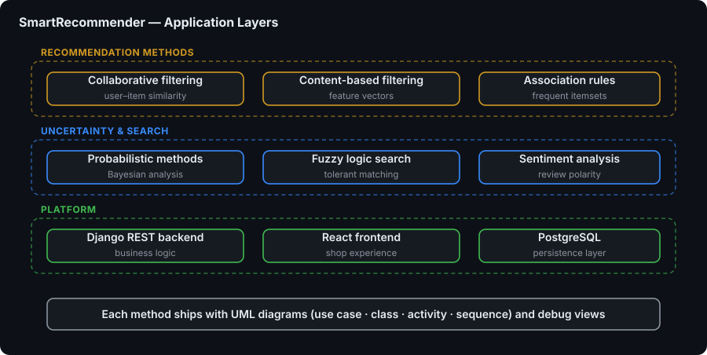
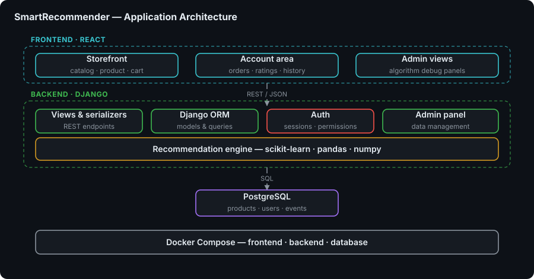

# SmartRecommender

> 🚀 **Full-Stack Product Recommendation Platform** - Six recommendation methods written from scratch, wired into a working e-commerce store

**SmartRecommender** is a full-stack e-commerce platform that delivers personalized product recommendations by combining collaborative filtering, content analysis, association mining, fuzzy logic, sentiment analysis and probabilistic modelling. Every recommendation method is implemented from the ground up on top of NumPy, pandas and scikit-learn rather than pulled in from a ready-made recommender library, which makes the repository as much a study of the algorithms as it is a shop.

The system pairs a Django REST Framework API with a React 18 storefront and a PostgreSQL 16 database, all reproducible through Docker. It was developed as an engineering thesis project, so alongside the application you will find the full academic apparatus: per-method algorithm write-ups, UML diagrams and entity-relationship documentation.


---

## 🎯 Key Features

- 🤝 **Collaborative Filtering** — user-based and item-based similarity matrices that recommend products based on what comparable customers bought.
- 🏷️ **Content-Based Filtering** — matches products by their own attributes, categories and tags against what a user has already liked.
- 🛒 **Association Rules** — an Apriori implementation that surfaces "frequently bought together" sets from real order history.
- 🔍 **Fuzzy Search** — typo-tolerant, partial-match product search backed by a dedicated fuzzy logic engine.
- 💬 **Sentiment Analysis** — analyses customer reviews with TextBlob/NLTK so positively received products can be discovered and ranked.
- 🎲 **Probabilistic Methods** — Markov chains for next-purchase prediction and Bayesian insights over user behaviour.
- 📊 **Admin Analytics Dashboard** — sales forecasting, product demand prediction, churn risk assessment, RFM purchase-pattern analysis and seasonal trends.
- 🧪 **Algorithm Debug Endpoints** — every recommendation family exposes a debug view so its intermediate output can be inspected instead of guessed at.
- 🛍️ **Complete Storefront** — catalog browsing, product detail pages, favourites, cart, orders, complaints and a client panel.
- 🔐 **JWT Authentication** — token-based auth with role separation between clients and administrators.

---

## 🖼️ Screenshots

| Storefront landing page | Product catalog |
|---|---|
|  |  |

---

## 🏗️ Architecture

### Application Layer



### Application Architecture



### 📐 UML & Database Documentation

The repository carries a full set of modelling artifacts produced alongside the implementation.

- **`.diagrams/`** — UML diagrams grouped per recommendation method: `association_rules`, `collaborative_filtering`, `content_based_filtering`, `fuzzy_search`, `probabilistic_methods` and `sentiment_analysis`. Each folder holds Use Case, Class, Activity, Sequence, Component or State diagrams (depending on the method) as both editable `.uml` sources and rendered `.png` exports.
- **`.database/entity-relationship-diagram/`** — entity-relationship diagrams for the schema (`erd.png`, `appErd.png`, `methodsErd.png`) together with the `erd.pgerd` project file and `erd.sql`.
- **`.database/`** — `backup.sql`, `RELATIONSHIPS_IN_BASE.md` and `tree_database.png` documenting the relational model.
- **`.methods/`** — a written specification per algorithm explaining how each method is computed.
- **`.docs/`** — the thesis text, LaTeX sources and presentation material.

---

## 🧩 Recommendation Methods

| Method | What it does | Implementation |
|---|---|---|
| Collaborative Filtering | Recommends what similar users purchased (user-based and item-based) | `backend/home/recommendation_views.py`, `custom_recommendation_engine.py` |
| Content-Based Filtering | Recommends products with attributes similar to previously liked items | `backend/home/recommendation_views.py` |
| Association Rules | Apriori mining of frequently bought together product sets | `backend/home/association_views.py` |
| Fuzzy Search | Typo-tolerant search and fuzzy-logic ranking | `backend/home/fuzzy_logic_engine.py`, `fuzzy_debug_view.py` |
| Sentiment Analysis | Review sentiment scoring and sentiment-driven discovery | `backend/home/sentiment_views.py` |
| Probabilistic Methods | Markov next-purchase prediction and Bayesian insights | `backend/home/probabilistic_views.py`, `probabilistic_debug_view.py` |

Predictive analytics built on top of these methods — sales forecasting, demand prediction, churn risk and purchase patterns — live in `backend/home/analytics.py`, `analytics_views.py` and `seasonal_views.py`.

---

## 🛠️ Technology Stack

### Frontend

- **React 18** with **React Router 6** for routing
- **CRACO** build tooling on top of `react-scripts` 5
- **SCSS / Sass** and **Tailwind CSS** for styling
- **Chart.js**, **react-chartjs-2** and **Recharts** for analytics visualisations
- **Axios** for API calls, **jwt-decode** for token handling
- **Formik** + **Yup** for forms and validation
- **Framer Motion**, **React Spring**, **react-slick**, **react-toastify** for interaction and UI polish
- **Lucide**, **React Icons**, **React Feather** icon sets

### Backend

- **Django 5.1** with **Django REST Framework 3.15**
- **django-cors-headers**, **django-environ** for configuration
- **psycopg2-binary** as the PostgreSQL driver
- **NumPy**, **pandas**, **scikit-learn** for the recommendation computations
- **TextBlob** and **NLTK** for sentiment processing
- **Pillow** for product image handling
- **tqdm** for seeder progress output

### Infrastructure

- **PostgreSQL 16** with a healthchecked container and persistent volume
- **Docker Compose** orchestrating `db`, `backend` and `frontend` services
- **GitHub Pages** for the static preview deployment (`gh-pages`)

---

## 🚀 Getting Started

### Prerequisites

- **Docker Desktop** installed, with **hardware virtualization** enabled (Intel VT-x or AMD-V) — for the Docker path
- **Python 3.x**, **Node.js** and a local **PostgreSQL 16** instance — for the manual path
- **Git**

### 1. Clone the Repository

```bash
git clone https://github.com/dawidolko/SmartRecommender-Project-Django-React
cd SmartRecommender-Project-Django-React
```

### 2. Configure Environment Variables

Create a `.env` file (see `backend/.env.example` for the template):

```bash
# Security Key
SECRET_KEY=django-insecure-default-key

# Debug Mode
DEBUG=True
ALLOWED_HOSTS=localhost,127.0.0.1

# Database Settings
DB_NAME=product_recommendation
DB_USER=postgres
DB_PASSWORD=admin
DB_HOST=db          # use "localhost" for the manual setup
DB_PORT=5432
```

### 3. Run

#### Option 1 — Docker (recommended)

```bash
docker compose -f .tools/docker/docker-compose.yml up --build
```

On first start the backend container waits for PostgreSQL, then runs migrations, creates the `recommendation_cache_table` cache table, seeds the database and verifies media files before launching the development server.

Once it is up:

- **Frontend (React)** → [http://localhost:3000](http://localhost:3000)
- **Backend (Django)** → [http://localhost:8000](http://localhost:8000)
- **Database (PostgreSQL)** → port `5432`

**Docker management commands**

```bash
# Run in background
docker compose -f .tools/docker/docker-compose.yml up -d --build

# Stop containers
docker compose -f .tools/docker/docker-compose.yml down

# View logs
docker compose -f .tools/docker/docker-compose.yml logs -f

# Enter the backend container
docker exec -it SmartRecommender-Django-BACKEND bash

# Enter the database
docker exec -it SmartRecommender-PostgreSQL-DB psql -U postgres -d product_recommendation
```

#### Option 2 — Startup scripts

Ready-to-use startup scripts ship for both platforms.

```bash
# Windows — backend
cd backend
start.bat

# Windows — frontend (new terminal)
cd frontend
start.bat
```

```bash
# Linux/macOS — backend
cd backend
chmod +x start.sh
./start.sh

# Linux/macOS — frontend (new terminal)
cd frontend
chmod +x start.sh
./start.sh
```

#### Option 3 — Manual setup

**Backend (Django)**

```bash
cd backend
python -m venv venv
source venv/bin/activate          # Windows: venv\Scripts\activate

pip install -r requirements.txt

# Configure your PostgreSQL connection in .env (see .env.example)
python manage.py migrate
python manage.py seed

python manage.py runserver
```

The backend will be available at [http://127.0.0.1:8000/](http://127.0.0.1:8000/).

**Frontend (React)**

```bash
cd frontend
npm install
npm start
```

The frontend will be available at [http://localhost:3000/](http://localhost:3000/).

---

## 📁 Project Structure

```
SmartRecommender-Project-Django-React/
├── .database/                        # Database resources
│   ├── entity-relationship-diagram/  # ERD diagrams (erd, appErd, methodsErd)
│   ├── backup.sql                    # Database backup
│   ├── RELATIONSHIPS_IN_BASE.md      # Relationship documentation
│   └── tree_database.png             # Visual DB structure
│
├── .diagrams/                        # UML diagrams per recommendation method
│   ├── association_rules/            # UseCase / Class / Activity / Sequence / Component
│   ├── collaborative_filtering/
│   ├── content_based_filtering/
│   ├── fuzzy_search/
│   ├── probabilistic_methods/
│   └── sentiment_analysis/
│
├── .docs/                            # Thesis text, LaTeX sources, presentation
├── .methods/                         # Written specification per algorithm
├── .github/                          # GitHub configuration
│
├── .tools/docker/                    # Docker configuration
│   ├── docker-compose.yml
│   ├── Dockerfile.backend
│   └── Dockerfile.frontend
│
├── backend/                          # Django backend
│   ├── core/                         # Project settings, URLs, ASGI/WSGI
│   ├── home/                         # Main application
│   │   ├── models.py                 # Domain model
│   │   ├── urls.py                   # Full REST API map
│   │   ├── views.py                  # Catalog, cart, orders, users, admin stats
│   │   ├── recommendation_views.py   # Collaborative & content-based endpoints
│   │   ├── association_views.py      # Apriori association rules
│   │   ├── sentiment_views.py        # Sentiment & fuzzy search endpoints
│   │   ├── probabilistic_views.py    # Markov / Bayesian endpoints
│   │   ├── analytics_views.py        # Forecasting, churn, purchase patterns
│   │   ├── seasonal_views.py         # Seasonal trend analysis
│   │   ├── custom_recommendation_engine.py
│   │   ├── fuzzy_logic_engine.py
│   │   └── management/               # Custom commands (seed)
│   ├── media/                        # Uploaded product images
│   ├── static/                       # Static files
│   ├── manage.py
│   ├── requirements.txt
│   └── start.sh / start.bat
│
├── frontend/                         # React frontend
│   ├── public/
│   ├── src/
│   │   ├── components/               # Reusable components (admin, client, shop)
│   │   ├── pages/                    # Home, Shop, Cart, Favorites, panels, ...
│   │   ├── context/                  # React context providers
│   │   ├── config/                   # API configuration
│   │   ├── utils/                    # Helpers
│   │   └── App.js
│   ├── craco.config.js
│   ├── package.json
│   └── start.sh / start.bat
│
├── docs/                             # README assets
│   ├── diagrams/                     # app-layer.svg, architecture.svg
│   └── screenshots/                  # home.webp, catalog.webp
│
├── images/                           # Team photos
├── CONTRIBUTING.md
├── SECURITY.md
├── LICENSE
└── README.md
```

---

## 🔌 API Overview

The REST API is documented in detail at the top of `backend/home/urls.py`. It is organised into ten groups:

| Group | Examples |
|---|---|
| Authentication & users | `/api/login/`, `/api/register/`, `/api/token/refresh/`, `/api/me/`, `/api/users/` |
| Product catalog | `/api/products/`, `/api/products/search/`, `/api/categories/`, `/api/tags/` |
| Cart & orders | `/cart/preview/`, `/cart/update/<id>/`, `/api/orders/` |
| Customer service | `/api/complaints/` |
| Recommendations | `/api/recommended-products/`, `/api/process-recommendations/`, `/api/interaction/` |
| Association rules | `/api/frequently-bought-together/`, `/api/association-rules/` |
| Probabilistic analytics | `/api/markov-recommendations/`, `/api/bayesian-insights/` |
| Predictive analytics | `/api/sales-forecast/`, `/api/product-demand/`, `/api/risk-dashboard/` |
| Sentiment & fuzzy | `/api/sentiment-search/`, `/api/fuzzy-search/` |
| Admin dashboards | `/api/admin-stats/`, `/api/admin-dashboard-stats/`, `/api/client-stats/` |

Access control follows three levels: `AllowAny` for public browsing, `IsAuthenticated` for cart, orders and reviews, and `IsAdminUser` for user management, product CRUD and analytics.

---

## 💾 Database Structure

The system uses PostgreSQL with a schema of interconnected tables covering:

- **Core entities** — Users, Products, Categories, Tags
- **E-commerce** — Orders, Cart, Complaints, Reviews
- **Recommendation data** — similarity matrices, user interactions, association rules
- **Analytics** — sentiment summaries, purchase patterns, risk assessment

Full documentation, the ERD set and a database backup live in the `.database/` directory.

---

## 🌍 Live Demo

🔗 **Preview version:** [project.dawidolko.pl](https://project.dawidolko.pl)

> **⚠️ Note:** This is a **static preview** hosted on GitHub Pages. Only the homepage and basic navigation work. Features requiring database connectivity — shopping cart, user accounts, recommendations, admin dashboards — are **not functional** in this demo.
>
> **💡 For the full experience:** follow the installation guide above to run the complete application with all features enabled.

---

## 🧑‍💻 Team

<table>
  <tr>
    <td align="center"><br /><sub><b>Dawid Olko</b></sub><br /><sub>Creator</sub></td>
    <td align="center"><br /><sub><b>Dr. Piotr Grochowalski</b></sub><br /><sub>Supervisor</sub></td>
    <td align="center"><br /><sub><b>Piotr Smoła</b></sub><br /><sub>Creator</sub></td>
  </tr>
</table>

> This project was developed as part of an engineering thesis.

---

## 🤝 Contributing

Contributions are welcome — see [CONTRIBUTING.md](CONTRIBUTING.md) for guidelines and [SECURITY.md](SECURITY.md) for the vulnerability disclosure policy.

---

## 📄 License

This project is licensed under the [Apache License 2.0](LICENSE).

---

## 👨‍💻 Author

Created by **[Dawid Olko](https://github.com/dawidolko)**

- **Website** — [dawidolko.pl](https://dawidolko.pl/)
- **LinkedIn** — [@dawidolko](https://www.linkedin.com/in/dawidolko/)
